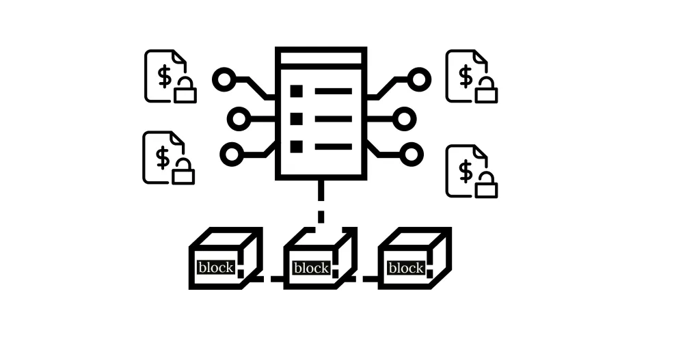

# Smart Contract: Explained

To understand a smart contract, let us first dive into the basics of a contract. A legal contract must suffice some criteria such as of being offered, mutually consented, legal, signed, and must be accepted by the other party. A smart contract is a digital version of it and is smart not only because it is digital but for its underlying technology, blockchain.

Blockchain is a cryptographically secure data block bound together in a chain with no central supervision. And yes, we are referring to a decentralized economy and business model. In this type of chain, the input of one block depends on the output of its preceding block and are connected through hash pointers. If any malicious attempt been made to tamper, it will quickly affect the entire chain and thereby will freeze the entire chain. You now know the very basic security feature of blockchain. Let us now understand how this satisfies the criteria for a smart contract. There are two sides to look into. One being the program and the other being economics.

Programmatically speaking, a miner will create a block with the message, will append a nonce \(any random hexadecimal value\), and then hash it. Blockchain uses a SHA256 hashing technique which means that any length of string can be put as input and after hashing it will produce a fixed length string of 256 bits. This will make the block approved and will show the proof-of-work. Proof-of-work is what makes it almost unhackable. A hacker who would want to get the message would have to add as many nonce to get the same result. This is a cryptographic puzzle that takes high computational power and a lot of time. The very reason I mentioned it as ‘almost unhackable’. Another way to establish a proof-of-work is to use a newer technology called zk-snark \(Zero-Knowledge Succinct Non-Interactive Argument of Knowledge\). This still validates the work but doesn’t reveal any knowledge of the data. To understand it better, you would need to understand how Ethereum \(an open-source, public, blockchain-based distributed computing platform and operating system\) adopted and implemented it. Now you got the juice of it and so let’s complete the contract by signing it. To make it digitally signed, a public-private key pair is to be used. Suppose, X is creating a smart contract for Y. Y has its own public-private key pair. X will then encrypt the contract with Y’s public key. Y will then be able to decrypt the smart contract from its own private key. Thus, you get a smart contract.

The other aspect of a contract, economics, must hold both parties responsible too. Therefore, a legal angle is necessary. But in an decentralized economy, how would you hold someone responsible? Economically speaking, the contract has to have a reward and punishment system too. A cryptocurrency would be apt here. Upon successful mining of the block, there has to be an exchange of cryptocurrency to the successful miner. Upon failure, this has to be taken away. There can be other ways to incorporate economics angle into a smart contract too. As I never created a smart contract, neither owned it, nor transacted using it and so putting irrelevant ideas would be absurd for me.

The future of internet, currency, and the way we connect and interact \(internet of things\) is going to change. Only time will tell, how well this will be accepted and received by the people.

